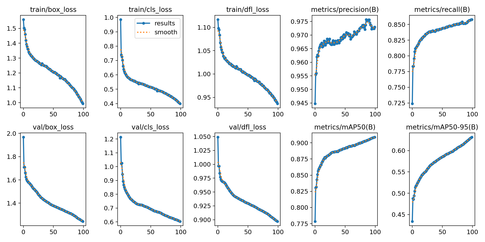
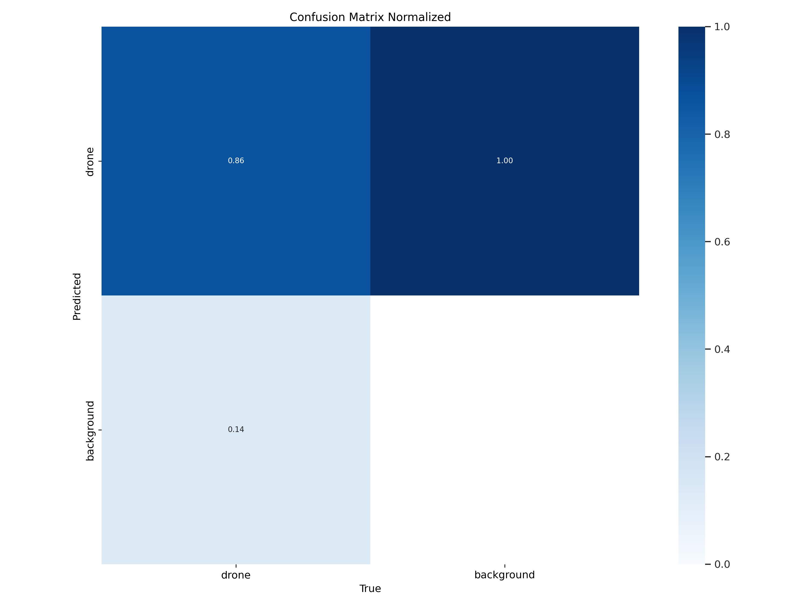
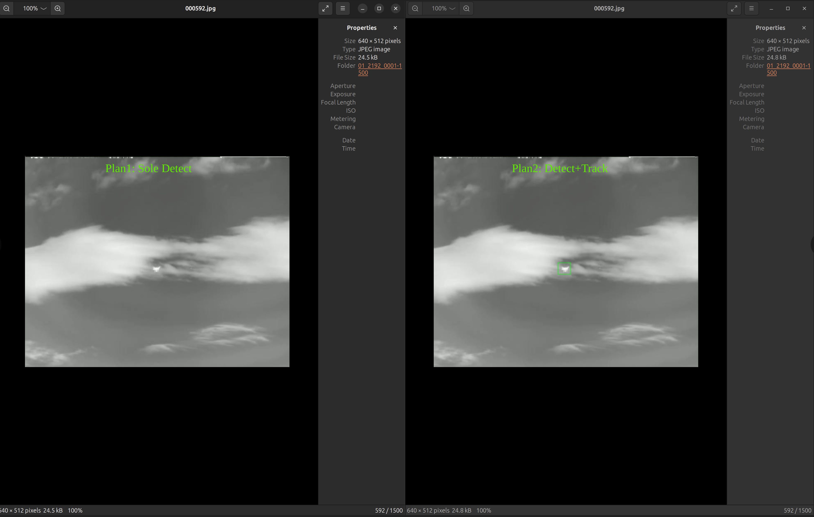

# YOLOv8红外热成像无人机检测与追踪

## 介绍

本项目基于YOLOv8的目标检测和追踪模块利用两种方案实现了无人机的检测。
第一种方案是仅把原任务看做目标检测任务，使用train数据集中的所有图片和标间进行目标检测训练。
第二种方案是把原任务看做目标检测+目标追踪任务，旨在通过分析无人机运动轨迹进一步提升模型精度。

## 项目运行方式

### 预处理及训练

项目运行可以参照如下步骤：

- 将原始的数据集“无人机检测与追踪”移动至项目根目录下
- 为便于YOLO处理数据，运行```data_prepro.py```将原始数据集重构，重构好的数据集被存放在Dataset文件夹
- 编辑```data.yaml```文件，'path'部分填写Dataset文件夹的绝对路径
- 运行```train.py```文件开始训练检测模型，默认使用的模型为yolov8n。预训练模型由官网提供，这里是[下载链接](https://github.com/ultralytics/assets/releases/download/v0.0.0/yolov8n.pt)，下载好的权重文件应命名为yolov8n.pt，放入weights文件夹中
- 训练完毕后，模型会被保存在runs/detect/trainxx/weights中，我设置的训练轮次为100，我的训练模型可以通过下面的网盘链接下载

  - 链接: <https://pan.baidu.com/s/14NNcQY1PWTp7X0NsMwDaeA?pwd=usw8> 提取码: usw8 

### 在测试集上测试

在测试机上测试参考如下步骤：

- 将训练好的目标检测模型放在weights中，模型名默认为 best.py
- 运行```test_detect.py```文件，仅使用检测器预测，预测的结果被保存在test_res/detect_res
- 运行```test_detect+tracking.py```文件，使用检测器和追踪器预测，预测的结果被保存在test_res/detect+tracking_res

## 检测器的训练结果

训练阶段100个epoch的结果见下图



## 引入追踪有效性的直观分析

通过对两种方案的比较发现，使用轨迹确实能够对检测无人机起到辅助作用，下图是其中的一个示例
